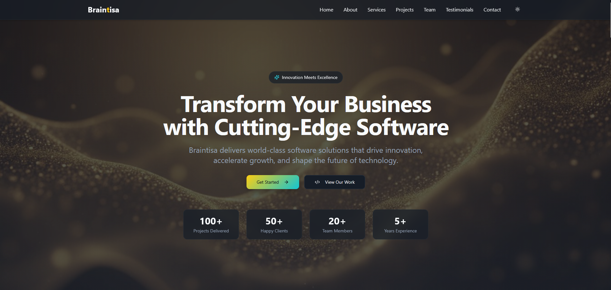
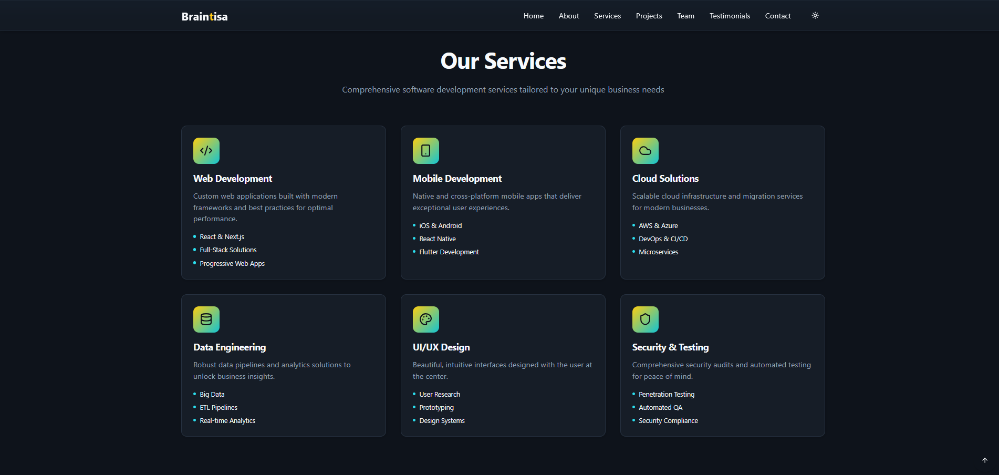
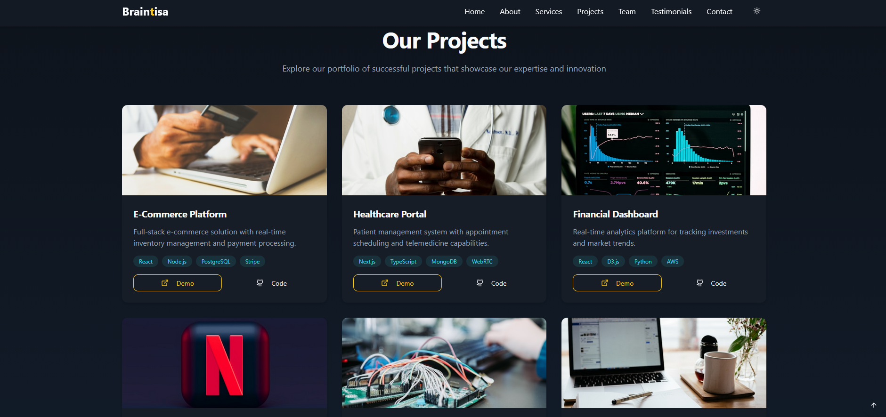
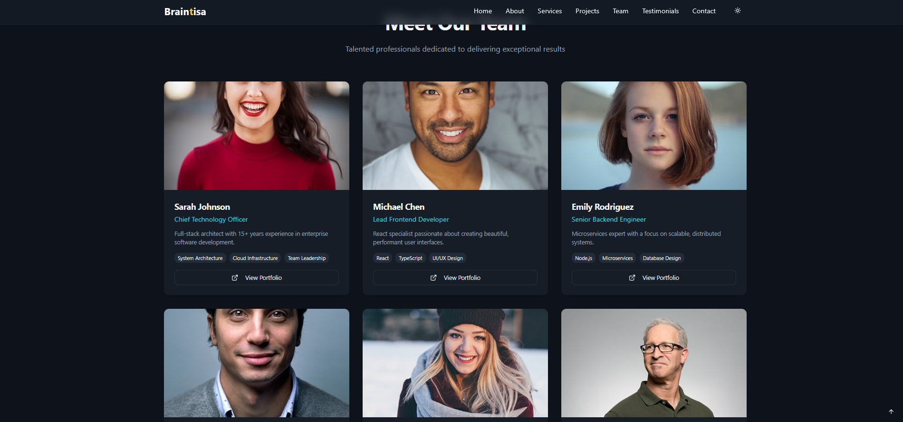
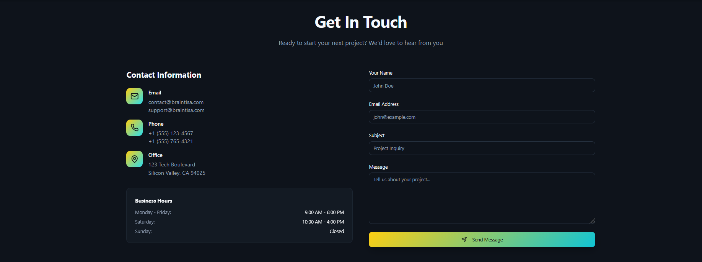

# Braintisa

A modern, high-performance marketing website for Braintisa software consultancy. Built with React, TypeScript, and Tailwind CSS, featuring smooth animations, responsive design, and an intuitive user experience.

## Overview

Braintisa Showcase is a single-page application designed to present our consultancy services, portfolio, team, and client testimonials in a visually engaging format. The site emphasizes performance, accessibility, and maintainability through modern web development practices.

## Key Features

- **Responsive Design** – Fully optimized for desktop, tablet, and mobile devices
- **Theme Support** – Dark/light mode toggle with persistent user preferences
- **Smooth Navigation** – Animated scroll-to-section functionality and scroll-to-top control
- **Interactive Components** – Animated cards, hover states, and transitions
- **Validated Contact Form** – Client-side validation with toast notifications
- **Data-Driven Architecture** – Structured content modules for easy maintenance
- **Performance Optimized** – Built with Vite for fast development and production builds

## Technology Stack

| Category | Technologies |
|----------|-------------|
| **Core** | React 18, TypeScript, Vite |
| **Styling** | Tailwind CSS, shadcn/ui components |
| **UI Primitives** | Radix UI |
| **State Management** | TanStack Query |
| **Form Handling** | React Hook Form |
| **Icons** | Lucide React |
| **Routing** | React Router |
| **Utilities** | clsx, tailwind-merge |

## Quick Start

### Prerequisites

- Node.js 18 or higher
- npm, yarn, or pnpm

### Installation

```bash
# Clone the repository
git clone <repository-url>
cd braintisa-showcase

# Install dependencies
npm install
```

### Development

```bash
# Start development server
npm run dev
```

The application will be available at `http://localhost:5173` (or the next available port).

### Production

```bash
# Create production build
npm run build

# Preview production build locally
npm run preview
```

## Available Scripts

| Command | Description |
|---------|-------------|
| `npm run dev` | Start development server with hot module replacement |
| `npm run build` | Generate optimized production build in `dist/` |
| `npm run preview` | Serve production build locally for testing |
| `npm run lint` | Run ESLint to check code quality |

## Project Architecture

```
braintisa-showcase/
├── public/                  # Static assets
├── src/
│   ├── components/          # React components
│   │   ├── ui/             # shadcn/ui primitives
│   │   ├── Navbar.tsx
│   │   ├── Hero.tsx
│   │   ├── About.tsx
│   │   ├── Services.tsx
│   │   ├── Projects.tsx
│   │   ├── Team.tsx
│   │   ├── Testimonials.tsx
│   │   ├── Contact.tsx
│   │   └── Footer.tsx
│   ├── data/               # Content modules
│   │   ├── companyData.ts
│   │   ├── servicesData.ts
│   │   ├── projectsData.ts
│   │   ├── teamData.ts
│   │   └── testimonialsData.ts
│   ├── hooks/              # Custom React hooks
│   ├── lib/                # Utility functions
│   ├── pages/              # Route components
│   ├── styles/             # Global styles
│   ├── App.tsx             # Application root
│   └── main.tsx            # Entry point
├── tailwind.config.ts      # Tailwind configuration
├── tsconfig.json           # TypeScript configuration
├── vite.config.ts          # Vite configuration
└── package.json            # Project dependencies
```

## Core Components

### Navbar
Fixed header with glass-effect styling, responsive navigation menu, and integrated theme toggle.

### Hero
Animated landing section with call-to-action buttons featuring smooth scroll navigation.

### Services
Grid layout showcasing consultancy offerings with detailed feature lists.

### Projects
Portfolio showcase with project cards displaying technologies and external links.

### Team
Team member profiles with skills, bios, and portfolio links.

### Testimonials
Client feedback carousel with ratings and testimonial content.

### Contact
Dual-column layout featuring company contact information and a validated submission form.

### Footer
Multi-column footer with social links, company information, and animated scroll-to-top button.

## Data Management

Content is managed through structured TypeScript modules in `src/data/`:

- **companyData.ts** – Company profile, statistics, contact information, business hours
- **servicesData.ts** – Service offerings with feature descriptions
- **projectsData.ts** – Portfolio projects with technology stacks and links
- **teamData.ts** – Team member information, skills, and portfolios
- **testimonialsData.ts** – Client testimonials with ratings

This architecture enables easy content updates without modifying component logic. See `src/data/README.md` for detailed schema documentation.

## Styling System

### Tailwind CSS Configuration
Custom theme configuration in `tailwind.config.ts` includes:
- Extended color palette
- Custom animations and keyframes
- Gradient utilities
- Responsive breakpoints

### Theme Support
- Powered by `next-themes` for persistent theme preferences
- Supports system preference detection
- Smooth transitions between themes

### Component Styling
- shadcn/ui components provide consistent, accessible UI primitives
- Custom utility classes for glass effects and gradients
- Tailwind animations for entrance effects and interactions

## User Experience Features

### Animations
- Staggered entrance animations for section content
- Smooth scroll behavior for navigation
- Hover effects and transitions on interactive elements
- Fade and slide animations for dynamic components

### Interactions
- Smooth scrolling to target sections
- Scroll-to-top button (appears after 300px scroll)
- Form validation with real-time feedback
- Toast notifications for user actions

### Accessibility
- Semantic HTML structure
- ARIA labels and roles
- Keyboard navigation support
- Screen reader compatibility

## Toast Notifications

Custom toast implementation (`src/hooks/use-toast.ts`) provides:
- Queue management with configurable limits
- Auto-dismiss timers
- Multiple toast types (success, error, info, warning)
- Integration with shadcn/ui Toaster component

## Code Quality

### Linting
ESLint configured for React and TypeScript best practices. Run checks with:
```bash
npm run lint
```

### Type Safety
Full TypeScript coverage ensures type safety across the application.

## Deployment

The build output is production-ready static assets suitable for:
- **Static Hosting**: Netlify, Vercel, GitHub Pages
- **CDN Deployment**: Cloudflare Pages, AWS S3 + CloudFront
- **Traditional Hosting**: Apache, Nginx

### Build Output
Production builds are generated in the `dist/` directory and include:
- Minified and optimized JavaScript bundles
- Code splitting for improved performance
- Optimized CSS with unused styles purged
- Compressed assets

## Browser Support

- Chrome/Edge (last 2 versions)
- Firefox (last 2 versions)
- Safari (last 2 versions)
- Modern mobile browsers

## Contributing

Contributions are welcome. Please ensure:
- Code passes ESLint checks
- TypeScript types are properly defined
- Components follow existing patterns
- Commit messages are descriptive

## Screenshots

### Home Page


### Services


### Projects


### Team


### Contact


## License

This project is proprietary software. All rights reserved.

## Support

For questions or support, please contact the development team or open an issue in the repository.

---

**Built with ❤️ by the Braintisa Team**
